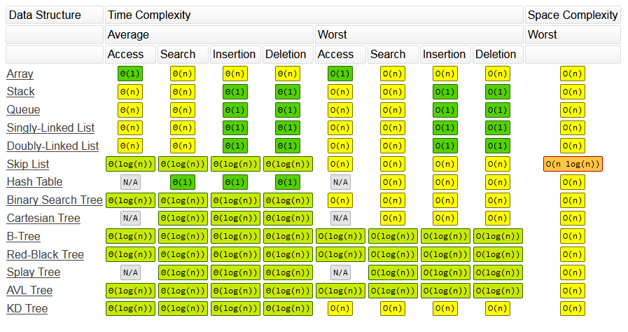

# algorithm-in-js
记录自己的算法学习之路

# Common Data Structure Operations

> 图片来源：https://www.bigocheatsheet.com/

# [堆栈&队列](https://github.com/Victor151222/algorithm-in-js/tree/master/%E5%A0%86%E6%A0%88%26%E9%98%9F%E5%88%97)

1. [LeetCode--20. 有效的括号](https://github.com/Victor151222/algorithm-in-js/blob/master/%E5%A0%86%E6%A0%88%26%E9%98%9F%E5%88%97/LeetCode--20.%20%E6%9C%89%E6%95%88%E7%9A%84%E6%8B%AC%E5%8F%B7.md)

2. [LeetCode--225. 用队列实现栈](https://github.com/Victor151222/algorithm-in-js/blob/master/%E5%A0%86%E6%A0%88%26%E9%98%9F%E5%88%97/LeetCode--225.%20%E7%94%A8%E9%98%9F%E5%88%97%E5%AE%9E%E7%8E%B0%E6%A0%88.md)

3. [LeetCode--232. 用栈实现队列](https://github.com/Victor151222/algorithm-in-js/blob/master/%E5%A0%86%E6%A0%88%26%E9%98%9F%E5%88%97/LeetCode--232.%20%E7%94%A8%E6%A0%88%E5%AE%9E%E7%8E%B0%E9%98%9F%E5%88%97.md)

4. [LeetCode--239. 滑动窗口最大值](https://github.com/Victor151222/algorithm-in-js/blob/master/%E5%A0%86%E6%A0%88%26%E9%98%9F%E5%88%97/LeetCode--239.%20%E6%BB%91%E5%8A%A8%E7%AA%97%E5%8F%A3%E6%9C%80%E5%A4%A7%E5%80%BC.md)

5. [LeetCode--703. 数据流中的第K大元素](https://github.com/Victor151222/algorithm-in-js/blob/master/%E5%A0%86%E6%A0%88%26%E9%98%9F%E5%88%97/LeetCode--703.%20%E6%95%B0%E6%8D%AE%E6%B5%81%E4%B8%AD%E7%9A%84%E7%AC%ACK%E5%A4%A7%E5%85%83%E7%B4%A0.md)

# [哈希表](https://github.com/Victor151222/algorithm-in-js/tree/master/%E5%93%88%E5%B8%8C%E8%A1%A8)

1. [LeetCode--1. 两数之和](https://github.com/Victor151222/algorithm-in-js/blob/master/%E5%93%88%E5%B8%8C%E8%A1%A8/LeetCode--1.%20%E4%B8%A4%E6%95%B0%E4%B9%8B%E5%92%8C.md)

2. [LeetCode--15. 三数之和](https://github.com/Victor151222/algorithm-in-js/blob/master/%E5%93%88%E5%B8%8C%E8%A1%A8/LeetCode--15.%20%E4%B8%89%E6%95%B0%E4%B9%8B%E5%92%8C.md)

3. [LeetCode--242. 有效的字母异位词](https://github.com/Victor151222/algorithm-in-js/blob/master/%E5%93%88%E5%B8%8C%E8%A1%A8/LeetCode--242.%20%E6%9C%89%E6%95%88%E7%9A%84%E5%AD%97%E6%AF%8D%E5%BC%82%E4%BD%8D%E8%AF%8D.md)

# [链表](https://github.com/Victor151222/algorithm-in-js/tree/master/%E9%93%BE%E8%A1%A8)

1. [JS实现单向链表](https://github.com/Victor151222/algorithm-in-js/blob/master/%E9%93%BE%E8%A1%A8/JS%E5%AE%9E%E7%8E%B0%E5%8D%95%E5%90%91%E9%93%BE%E8%A1%A8.md)
2. [JS实现双向链表](https://github.com/Victor151222/algorithm-in-js/blob/master/%E9%93%BE%E8%A1%A8/JS%E5%AE%9E%E7%8E%B0%E5%8F%8C%E5%90%91%E9%93%BE%E8%A1%A8.md)
3. [LeetCode--141. 环形链表](https://github.com/Victor151222/algorithm-in-js/blob/master/%E9%93%BE%E8%A1%A8/LeetCode--141.%20%E7%8E%AF%E5%BD%A2%E9%93%BE%E8%A1%A8.md)
4. [LeetCode--206. 反转链表](https://github.com/Victor151222/algorithm-in-js/blob/master/%E9%93%BE%E8%A1%A8/LeetCode--206.%20%E5%8F%8D%E8%BD%AC%E9%93%BE%E8%A1%A8.md)
5. [LeetCode--24. 两两交换链表中的节点](https://github.com/Victor151222/algorithm-in-js/blob/master/%E9%93%BE%E8%A1%A8/LeetCode--24.%20%E4%B8%A4%E4%B8%A4%E4%BA%A4%E6%8D%A2%E9%93%BE%E8%A1%A8%E4%B8%AD%E7%9A%84%E8%8A%82%E7%82%B9.md)

# [树&二叉树&二叉搜索树]([https://github.com/Victor151222/algorithm-in-js/tree/master/%E6%A0%91%26%E4%BA%8C%E5%8F%89%E6%A0%91%26%E4%BA%8C%E5%8F%89%E6%90%9C%E7%B4%A2%E6%A0%91](https://github.com/Victor151222/algorithm-in-js/tree/master/树%26二叉树%26二叉搜索树))

1. [LeetCode--235. 二叉搜索树的最近公共祖先]([https://github.com/Victor151222/algorithm-in-js/blob/master/%E6%A0%91%26%E4%BA%8C%E5%8F%89%E6%A0%91%26%E4%BA%8C%E5%8F%89%E6%90%9C%E7%B4%A2%E6%A0%91/LeetCode--235.%20%E4%BA%8C%E5%8F%89%E6%90%9C%E7%B4%A2%E6%A0%91%E7%9A%84%E6%9C%80%E8%BF%91%E5%85%AC%E5%85%B1%E7%A5%96%E5%85%88.md](https://github.com/Victor151222/algorithm-in-js/blob/master/树%26二叉树%26二叉搜索树/LeetCode--235. 二叉搜索树的最近公共祖先.md))
2. [LeetCode--236. 二叉树的最近公共祖先]([https://github.com/Victor151222/algorithm-in-js/blob/master/%E6%A0%91%26%E4%BA%8C%E5%8F%89%E6%A0%91%26%E4%BA%8C%E5%8F%89%E6%90%9C%E7%B4%A2%E6%A0%91/LeetCode--236.%20%E4%BA%8C%E5%8F%89%E6%A0%91%E7%9A%84%E6%9C%80%E8%BF%91%E5%85%AC%E5%85%B1%E7%A5%96%E5%85%88.md](https://github.com/Victor151222/algorithm-in-js/blob/master/树%26二叉树%26二叉搜索树/LeetCode--236. 二叉树的最近公共祖先.md))
3. [LeetCode--98. 验证二叉搜索树]([https://github.com/Victor151222/algorithm-in-js/blob/master/%E6%A0%91%26%E4%BA%8C%E5%8F%89%E6%A0%91%26%E4%BA%8C%E5%8F%89%E6%90%9C%E7%B4%A2%E6%A0%91/LeetCode--98.%20%E9%AA%8C%E8%AF%81%E4%BA%8C%E5%8F%89%E6%90%9C%E7%B4%A2%E6%A0%91.md](https://github.com/Victor151222/algorithm-in-js/blob/master/树%26二叉树%26二叉搜索树/LeetCode--98. 验证二叉搜索树.md))