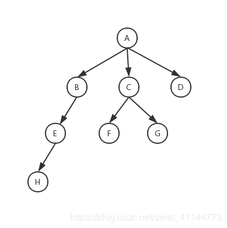
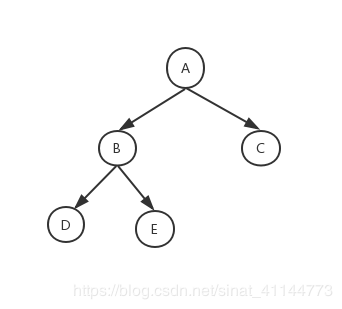

1. Linked List就是特殊化的Tree
2. Tree就是特殊化的Graph

# 树
树是n个结点的有限集合，有且仅有一个根结点，其余结点可分为m个根结点的子树。

# 二叉树
二叉树是每个节点最多拥有两个子节点，左子树和右子树是有顺序的不能任意颠倒。

# 二叉搜索树
二叉搜索树（Binary Search Tree），也称二叉查找树、有序二叉树（Ordered Binary Tree）、排序二叉树（Sorted Binary Tree），是指一颗空树或者具有下列性质的二叉树：
1. **左子树**上所有节点的值均小于它的根节点的值。
2. **右子树**上所有节点的值均大于它的根节点的值。
3. Recursively，左、右子树也分别为二叉查找树。

> 在Java、C++的标准库里面实现的二叉搜索树都是用红黑树才实现的。